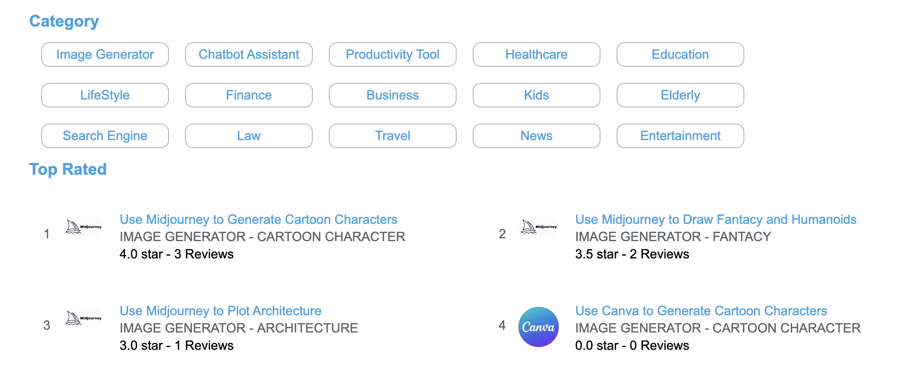
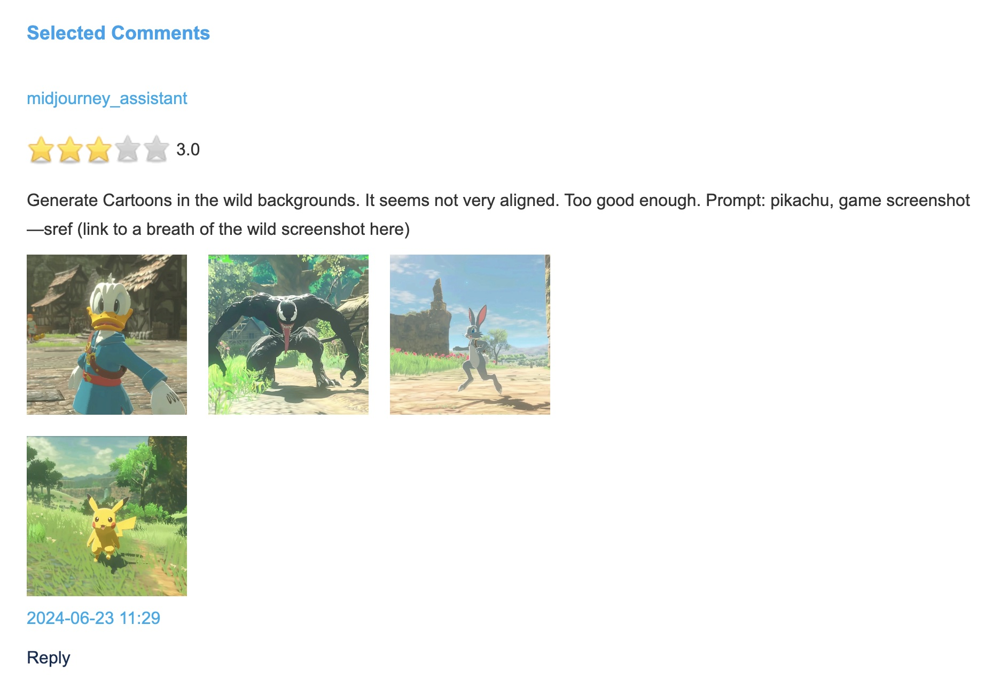
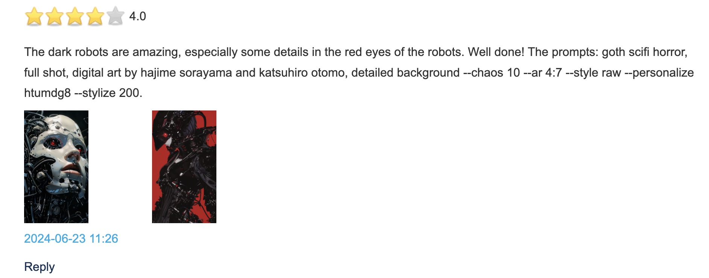
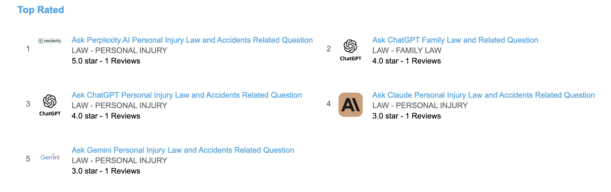
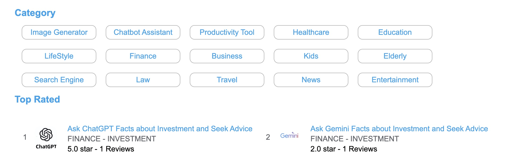
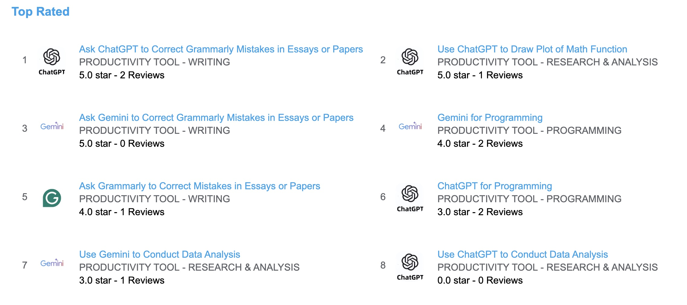

### AI Store

# DeepNLP AI Store
DeepNLP AI Store (http://www.deepnlp.org/store) is a newly released website to let users write genuine reviews, ratings, human evaluation, prompts and share use cases
about detailed aspects of AI services from users' perspective (different from researchers' perspective like the LLM/MultiModal benchmarks). 
We want to build the "Yelp" for AI and Robotics community and ease the burden of customers choosing various AI services. 

## Detailed AI Service Use Case
Users can write detailed reviews about some functions about an AI service (ChatGPT/Gemini/Perplexity/Midjourney/) like how AI is doing on "Correct Grammarly Mistakes in Essays", 
"Acting like doctors about Illness", or text-to-image ability like "Generate Cartoon Characters", "Draw Picture of Fantasy Humanoid", by uploading the screenshots
of a conversation or the generated images of AI image generator.

## Multi-Aspect Rating
Users can write review and give overall rating from 1 to 5 to each function of AI service, 
as well as give detailed rating of different aspects of each function, including "Correctness", "Helpfulness" and "Interesting", 
and customized aspects of each function, such as "Clarity of image", "Image Resolution", "Artistic", "Grammar", "Succintness" and more.

## All Categories and People Groups
We cover 30+ different categories of use cases, such as 
AI Image Generators, AI Assistant & Chatbot, AI Translator, AI Search Engine,
AI for kids, AI for adults, AI for elderly, AI in TRAVEL, AI in TRANSPORTATION
AI in HEALTHCARE, AI in BUSINESS, AI in FINANCE, AI in EDUCATION, AI in PRODUCTIVITY TOOL,
AI in POLITICS,  AI in ENTERTAINMENT, AI in NEWS, AI in ART AND SPORTS, AI in LIFESTYLE
AI in PAYMENT, AI in SOCIAL, AI in AGRICULTURE
AI in SCIENCE, AI in TECHNOLOGY, AI in TRAVEL, AI in TRANSPORTATION, AI in CAR, AI in CHARITY
AI in PUBLIC SERVICE, AI in HOUSING, AI in LAW, AI in COMMUNICATION, AI in FOOD

## Reviews and Rating of AI App Store By Categories

[AI IMAGE GENERATOR](http://www.deepnlp.org/store/image-generator)  
[AI Search Engine](http://www.deepnlp.org/store/search-engine)   
[AI Chatbot Assistant](http://www.deepnlp.org/store/chatbot-assistant)   
[AI for ELDERLY](http://www.deepnlp.org/store/elderly)   
[AI for KIDS](http://www.deepnlp.org/store/kids)   
[AI in LAW](http://www.deepnlp.org/store/law)  
[AI in FINANCE](http://www.deepnlp.org/store/finance)  
[AI in HEALTHCARE](http://www.deepnlp.org/store/healthcare)   
[AI in BUSINESS](http://www.deepnlp.org/store/business)   
[AI in EDUCATION](http://www.deepnlp.org/store/education)  
[AI in PRODUCTIVITY TOOL](http://www.deepnlp.org/store/productivity-tool)  
[AI in POLITICS](http://www.deepnlp.org/store/politics)  
[AI in ENTERTAINMENT](http://www.deepnlp.org/store/entertainment)  
[AI in NEWS](http://www.deepnlp.org/store/news)  
[AI in ART AND SPORTS](http://www.deepnlp.org/store/art-and-sports)  
[AI in LIFESTYLE](http://www.deepnlp.org/store/lifestyle)  
[AI in PAYMENT](http://www.deepnlp.org/store/payment)  
[AI in SOCIAL](http://www.deepnlp.org/store/social)  
[AI in AGRICULTURE](http://www.deepnlp.org/store/agriculture)  
[AI in SCIENCE](http://www.deepnlp.org/store/science)  
[AI in TECHNOLOGY](http://www.deepnlp.org/store/technology)  
[AI in TRAVEL](http://www.deepnlp.org/store/travel)  
[AI in TRANSPORTATION](http://www.deepnlp.org/store/transportation)  
[AI in CAR](http://www.deepnlp.org/store/car)  
[AI in CHARITY](http://www.deepnlp.org/store/charity)  
[AI in PUBLIC SERVICE](http://www.deepnlp.org/store/public-service)  
[AI in HOUSING](http://www.deepnlp.org/store/housing)  
[AI in COMMUNICATION](http://www.deepnlp.org/store/communication)  
[AI in FOOD](http://www.deepnlp.org/store/food)  

## AI Store of Image Generator
[AI Image Generator User Rating and Reviews](http://www.deepnlp.org/store/image-generator)  

DeepNLP AI store is a platform and community for user to write genuine user reviews and ratings of AI apps and services. User can upload pictures as showcase of AI Image Generator,
such as Midjourney, Canva, Stable Diffusion, etc. People can write reviews about some common user prompts (questions or intents), such as "Generate Cartoon Characters", "Draw Fantacy and Humanoids", "Plot Architecture" and more.

#### List of Image Generator Use Case and ShowCase

[Use Midjourney to Generate Cartoon Characters](http://www.deepnlp.org/store/image-generator/cartoon-character/pub-midjourney/use-midjourney-to-generate-cartoon-characters)  

[Use Midjourney to Draw Fantacy and Humanoids](http://www.deepnlp.org/store/image-generator/fantacy/pub-midjourney/use-midjourney-to-draw-fantacy-and-humanoids)  

[Use Midjourney to Plot Architecture](http://www.deepnlp.org/store/image-generator/architecture/pub-midjourney/use-midjourney-to-plot-architecture)

[Use Stable Diffusion to Generate Cartoon Characters](http://www.deepnlp.org/store/image-generator/cartoon-character/pub-stable-diffusion/use-stable-diffusion-to-generate-cartoon-characters)

[Use Stable Diffusion to Generate Fantacy and Humanoids](http://www.deepnlp.org/store/image-generator/fantacy/pub-stable-diffusion/use-stable-diffusion-to-generate-fantacy-and-humanoids)

[Use Canva to Draw Fantacy and Humanoids](http://www.deepnlp.org/store/image-generator/fantacy/pub-canva/use-canva-to-draw-fantacy-and-humanoids)

## AI Store of Chatbot & Assistant: User Ratings, Reviews and Showcase
[AI  Chatbot & Assistant](http://www.deepnlp.org/store/chatbot-assistant)  

### RECENT NEWS & TREND
[AI in Chatbot Assistant RECENT NEWS & TREND](http://www.deepnlp.org/store/chatbot-assistant/recent-news-&-trend)  

### FUTURE EVENTS
[AI in Chatbot Assistant Future Events](http://www.deepnlp.org/store/chatbot-assistant/future-events)  

### ENCYCLOPAEDIA
[AI in Chatbot Assistant ENCYCLOPAEDIA](http://www.deepnlp.org/store/chatbot-assistant/encyclopaedia)  

## AI Store in Law: User Ratings, Reviews and Showcase

Prompts (Questions) exmaples
How do I file divorce in California and I want my 3 years old son's custody
Do I need a personal injury lawyer to get compensation as victims of car or truck accident?"

[AI in Law and Legal User Rating and Reviews](http://www.deepnlp.org/store/law)  

This question is related to the AI app ranking based on genuine user review and ratings. AI in Law covers multiple subfields, such as Employment Law,
Contracts and Agreements, Business and Corporate Law, Real Estate, Civil Rights Law, Family Law, Personal Injury, Criminal Law, Immigration Law.

You can visit these sub-categories to see complete list of AI app service ranking.

### Employment Law
[AI in Employment Law](http://www.deepnlp.org/store/law/employment-law)   

Employment Law AI App Performance Review, Ranking 
[ask-chatgpt-employment-law-related-questions](http://www.deepnlp.org/store/law/employment-law/pub-chatgpt-openai/ask-chatgpt-employment-law-related-questions)   
[ask perplexity ai employment law related questions](http://www.deepnlp.org/store/law/employment-law/pub-perplexity/ask-perplexity-ai-employment-law-related-questions)   
[ask gemini employment law related questions](http://www.deepnlp.org/store/law/employment-law/pub-gemini-google/ask-gemini-employment-law-related-questions)   
[ask claude employment law related questions](http://www.deepnlp.org/store/law/employment-law/pub-claude-anthropic/ask-claude-employment-law-related-questions)   

### Contracts and Agreements
[AI in Contracts and Agreements](http://www.deepnlp.org/store/law/contracts-and-agreements)   

Contracts and Agreements Law AI App Performance Review, Ranking
[Ask perplexity ai contracts and agreements related questions](http://www.deepnlp.org/store/law/contracts-and-agreements/pub-perplexity/ask-perplexity-ai-contracts-and-agreements-related-questions)   
[Ask chatgpt contracts and agreements related questions](http://www.deepnlp.org/store/law/contracts-and-agreements/pub-chatgpt-openai/ask-chatgpt-contracts-and-agreements-related-questions)   
[Ask gemini contracts and agreements related questions](http://www.deepnlp.org/store/law/contracts-and-agreements/pub-gemini-google/ask-gemini-contracts-and-agreements-related-questions)   
[Ask claude contracts and agreements related questions](http://www.deepnlp.org/store/law/contracts-and-agreements/pub-claude-anthropic/ask-claude-contracts-and-agreements-related-questions)   

###  Business and Corporate Law
[AI in Business and Corporate Law](http://www.deepnlp.org/store/law/business-and-corporate-law)

Business and Corporate Law AI App Performance Review, Ranking
[ask gemini business and corporate law related questions](http://www.deepnlp.org/store/law/business-and-corporate-law/pub-gemini-google/ask-gemini-business-and-corporate-law-related-questions)   
[ask chatgpt business and corporate law related questions](http://www.deepnlp.org/store/law/business-and-corporate-law/pub-chatgpt-openai/ask-chatgpt-business-and-corporate-law-related-questions)   
[ask perplexity ai business and corporate law related questions](http://www.deepnlp.org/store/law/business-and-corporate-law/pub-perplexity/ask-perplexity-ai-business-and-corporate-law-related-questions)   
[ask claude business and corporate law related questions](http://www.deepnlp.org/store/law/business-and-corporate-law/pub-claude-anthropic/ask-claude-business-and-corporate-law-related-questions)   

### Real Estate
[AI in Real Estate Law](http://www.deepnlp.org/store/law/real-estate)

Real Estate Law AI App Performance Review, Ranking

[ask-chatgpt-real-estate-related-questions](http://www.deepnlp.org/store/law/real-estate/pub-chatgpt-openai/ask-chatgpt-real-estate-related-questions)  
[ask-perplexity-ai-real-estate-related-questions](http://www.deepnlp.org/store/law/real-estate/pub-perplexity/ask-perplexity-ai-real-estate-related-questions)  
[ask-gemini-real-estate-related-questions](http://www.deepnlp.org/store/law/real-estate/pub-gemini-google/ask-gemini-real-estate-related-questions)  
[ask claude real estate related questions](http://www.deepnlp.org/store/law/real-estate/pub-claude-anthropic/ask-claude-real-estate-related-questions)  

### Civil Rights Law
[AI in Civil Rights Law](http://www.deepnlp.org/store/law/civil-rights-law)  

Civil Rights Law AI App Performance Review, Ranking
[ask perplexity ai civil rights law related questions](http://www.deepnlp.org/store/law/civil-rights-law/pub-perplexity/ask-perplexity-ai-civil-rights-law-related-questions)  
[ask gemini civil rights law related questions](http://www.deepnlp.org/store/law/civil-rights-law/pub-gemini-google/ask-gemini-civil-rights-law-related-questions)  
[ask chatgpt civil rights law related questions](http://www.deepnlp.org/store/law/civil-rights-law/pub-chatgpt-openai/ask-chatgpt-civil-rights-law-related-questions)  
[ask claude civil rights law related questions](http://www.deepnlp.org/store/law/civil-rights-law/pub-claude-anthropic/ask-claude-civil-rights-law-related-questions)  

### Family Law
[AI in Family Law](http://www.deepnlp.org/store/law/family-law)

Family Law AI App Performance Review, Ranking

[Ask chatgpt family law and related question](http://www.deepnlp.org/store/law/family-law/pub-chatgpt-openai/ask-chatgpt-family-law-and-related-question)  
[Ask claude family law related questions](http://www.deepnlp.org/store/law/family-law/pub-claude-anthropic/ask-claude-family-law-related-questions)  
[Ask perplexity ai family law related questions](http://www.deepnlp.org/store/law/family-law/pub-perplexity/ask-perplexity-ai-family-law-related-questions)  
[Ask gemini family law related questions](http://www.deepnlp.org/store/law/family-law/pub-gemini-google/ask-gemini-family-law-related-questions)  

### Personal Injury
[AI in Personal Injury](http://www.deepnlp.org/store/law/personal-injury)  

Personal Injury AI App Performance Review, Ranking

[Ask perplexity ai personal injury law and accidents related question](http://www.deepnlp.org/store/law/personal-injury/pub-perplexity/ask-perplexity-ai-personal-injury-law-and-accidents-related-question)  
[Ask chatgpt personal injury law and accidents related question](http://www.deepnlp.org/store/law/personal-injury/pub-chatgpt-openai/ask-chatgpt-personal-injury-law-and-accidents-related-question)  
[Ask claude personal injury law and accidents related question](http://www.deepnlp.org/store/law/personal-injury/pub-claude-anthropic/ask-claude-personal-injury-law-and-accidents-related-question)  
[Ask gemini personal injury law and accidents related question](http://www.deepnlp.org/store/law/personal-injury/pub-gemini-google/ask-gemini-personal-injury-law-and-accidents-related-question)  

### Criminal Law
[AI in Criminal Law](http://www.deepnlp.org/store/law/criminal-law)

Criminal Law AI App Performance Review, Ranking

[Ask gemini criminal law related questions](http://www.deepnlp.org/store/law/criminal-law/pub-gemini-google/ask-gemini-criminal-law-related-questions)  
[Ask perplexity ai criminal law related questions](http://www.deepnlp.org/store/law/criminal-law/pub-perplexity/ask-perplexity-ai-criminal-law-related-questions)  
[Ask chatgpt criminal law related questions](http://www.deepnlp.org/store/law/criminal-law/pub-chatgpt-openai/ask-chatgpt-criminal-law-related-questions)  
[Ask claude criminal law related questions](http://www.deepnlp.org/store/law/criminal-law/pub-claude-anthropic/ask-claude-criminal-law-related-questions)  

### Immigration Law
[AI in immigration law](http://www.deepnlp.org/store/law/immigration-law)

[Ask perplexity ai immigration law related questions](http://www.deepnlp.org/store/law/immigration-law/pub-perplexity/ask-perplexity-ai-immigration-law-related-questions)  
[Ask gemini immigration law related questions](http://www.deepnlp.org/store/law/immigration-law/pub-gemini-google/ask-gemini-immigration-law-related-questions)  
[Ask chatgpt immigration law related questions](http://www.deepnlp.org/store/law/immigration-law/pub-chatgpt-openai/ask-chatgpt-immigration-law-related-questions)  
[Ask gemini criminal law related questions](http://www.deepnlp.org/store/law/criminal-law/pub-gemini-google/ask-gemini-criminal-law-related-questions)  

## AI Store in Finance

[AI for Finance User Rating and Reviews](http://www.deepnlp.org/store/finance)  

Prompts (Questions) exmaples
1. Is Tesla a Buy Stock?
2. How has the dollar-euro conversion rate changed recently?

Prompts (Questions)
How do I file divorce in California and I want my 3 years old son's custody
Do I need a personal injury lawyer to get compensation as victims of car or truck accident?"

### AI in Investment Finance
[AI in Finance Investment](http://www.deepnlp.org/store/finance/investment)  

[Ask ChatGPT Facts about Investment and Seek Advice](http://www.deepnlp.org/store/finance/investment/pub-chatgpt-openai/ask-chatgpt-facts-about-investment-and-seek-advice)  
[Ask Gemini Facts about Investment and Seek Advice](http://www.deepnlp.org/store/finance/investment/pub-chatgpt-openai/ask-chatgpt-facts-about-investment-and-seek-advice)   
[Ask Claude Facts about Investment and Seek Advice](http://www.deepnlp.org/store/finance/investment/pub-claude-anthropic/ask-claude-facts-about-investment-and-seek-advice)  

### AI in INSURANCE Finance
[AI in Finance INSURANCE](http://www.deepnlp.org/store/finance/insurance)

### AI in DEBT Finance
[AI in Debt Finance](http://www.deepnlp.org/store/finance/debt)

### AI in Mortgage and Loan Finance
[AI in Mortgage Loan Finance](http://www.deepnlp.org/store/finance/mortgage-&-loan)

### AI in BANKING Finance
[AI in BANKING Finance](http://www.deepnlp.org/store/finance/banking)

## AI in Healthcare

### HOSPITAL APPOINTMENT
[AI in HOSPITAL APPOINTMENT](http://www.deepnlp.org/store/healthcare/hospital-appointment)

### HOSPITAL
[AI in Hospital Healthcare](http://www.deepnlp.org/store/healthcare/hospital)

### AI in ILLNESS
[AI in ILLNESS Healthcare](http://www.deepnlp.org/store/healthcare/illness)

### MEDICINE
[AI in Medicine Healthcare](http://www.deepnlp.org/store/healthcare/medicine)

### NURSING
[AI in NURSING Healthcare](http://www.deepnlp.org/store/healthcare/nursing)

### BEAUTY
[AI in BEAUTY Healthcare](http://www.deepnlp.org/store/healthcare/nursing)

### ELDERLY CARE
[AI in ELDERLY CARE](http://www.deepnlp.org/store/healthcare/elderly-care)

### MEDICAL INSTRUMENT
[AI in MEDICAL INSTRUMENT](http://www.deepnlp.org/store/healthcare/medical-instrument)

## AI for Elderly: User Ratings, Reviews and Showcase

[AI for Elderly User Ratings, Reviews and Showcase](http://www.deepnlp.org/store/elderly)  

Prompts (Questions) exmaples
What are the side effects of [medication]?
How can I manage [illness]?

e.g. 
What are the side effects of Tylenol?
How can I manage arthritis pain?

### ShowCases
[Elderly People Ask Gemini Personal Hobbies Related Questions](http://www.deepnlp.org/store/elderly/hobby/pub-gemini-google/elderly-people-ask-gemini-personal-hobbies-related-questions)
[Elderly People Ask Gemini Legal Questions](http://www.deepnlp.org/store/elderly/legal/pub-gemini-google/elderly-people-ask-gemini-legal-questions)
[Elderly People Ask Gemini Health and Medicine Related Questions](http://www.deepnlp.org/store/elderly/health/pub-gemini-google/elderly-people-ask-gemini-health-and-medicine-related-questions)
[Elderly People Ask ChatGPT Health and Medicine Related Questions](http://www.deepnlp.org/store/elderly/health/pub-chatgpt-openai/elderly-people-ask-chatgpt-health-and-medicine-related-questions)
[Elderly People Ask Perplexity AI Health and Medicine Related Questions](http://www.deepnlp.org/store/elderly/health/pub-perplexity/elderly-people-ask-perplexity-ai-health-and-medicine-related-questions)
[Elderly People Ask Claude Health and Medicine Related Questions](http://www.deepnlp.org/store/elderly/health/pub-claude-anthropic/elderly-people-ask-claude-health-and-medicine-related-questions)

## AI for Kids: User Ratings, Reviews and Showcase

[AI for Elderly User Ratings, Reviews and Showcase](http://www.deepnlp.org/store/kids)

Prompts (Questions) exmaples
### STORY TELLING for KIDS
1. Please tell me a bedtime story about unicorns for my 4 years old daughter.
2. Help me write a story about Paw Patrol Dogs Fighting Bad Guys

### DRAWING|AIGC
1. Help me Draw a picture about Paw Patrol Dogs Chase Driving Police Car
2. Help me Draw a picture Peppa Pig playing in the swimming pool

## ShowCases
#### Gemini 
[Ask Gemini to Tell a Bedtime Story](http://www.deepnlp.org/store/kids/story-telling/pub-gemini-google/ask-gemini-to-tell-a-bedtime-story)

[Ask Gemini to Draw Cartoon Characters](http://www.deepnlp.org/store/kids/drawing/pub-gemini-google/ask-gemini-to-draw-cartoon-characters)

#### ChatGPT
[Ask Gemini to Tell a Bedtime Story](http://www.deepnlp.org/store/kids/story-telling/pub-chatgpt-openai/ask-chatgpt-to-tell-a-bedtime-story)

[Ask ChatGPT to Draw Cartoon Character](http://www.deepnlp.org/store/kids/drawing/pub-chatgpt-openai/ask-chatgpt-to-draw-cartoon-character)

## AI in LifeStyle: User Ratings, Reviews and Showcase

[AI for LifeStyle User Ratings, Reviews and Showcase](http://www.deepnlp.org/store/lifestyle)

Prompts (Questions) exmaples

## Act as ${role}
I want you to respond and answer like ${role} using the tone, manner that ${role} would use. Do not write any explanations. My first sentence is ${your_question}.

## ShowCases

#### ChatGPT

[Ask ChatGPT to Act As Lovers in a Relationship](http://www.deepnlp.org/store/lifestyle/relationship/pub-chatgpt-openai/ask-chatgpt-to-act-as-lovers-in-a-relationship)

#### Gemini
[Ask Gemini to Act As Lovers in a Relationship](http://www.deepnlp.org/store/lifestyle/relationship/pub-gemini-google/ask-gemini-to-act-as-lovers-in-a-relationship)

#### Character AI
[Ask Character AI to Act As Lovers in a Relationship](http://www.deepnlp.org/store/lifestyle/relationship/pub-character-ai/ask-character-ai-to-act-as-lovers-in-a-relationship)

#### Doubao
[Ask Doubao to Act As Lovers in a Relationship](http://www.deepnlp.org/store/lifestyle/relationship/pub-doubao-douyin/ask-doubao-to-act-as-lovers-in-a-relationship)

#### Qwen
[Ask Qwen AI from Alibaba to Act As Lovers in a Relationship](http://www.deepnlp.org/store/lifestyle/relationship/pub-qwen-alibaba/ask-qwen-ai-from-alibaba-to-act-as-lovers-in-a-relationship)

#### Zhipu AI

[Ask Zhipu AI to Act As Lovers in a Relationship](http://www.deepnlp.org/store/lifestyle/relationship/pub-zhipu-ai/ask-zhipu-ai-to-act-as-lovers-in-a-relationship)

## AI in Productivity Tool: User Ratings, Reviews and Showcase

[AI Productivity Tool](http://www.deepnlp.org/store/productivity-tool)

### Writing Tool
[AI Productivity Tool-Writing Tool](http://www.deepnlp.org/store/productivity-tool/writing)

### Research Analysis

[AI Productivity Tool-Research & Analysis](http://www.deepnlp.org/store/productivity-tool/research-&-analysis)

####  Programming

[AI Productivity Tool-Programming](http://www.deepnlp.org/store/productivity-tool/programming)

Prompts:
Show me the ${programming language} code of ${algorithm}, no explanation.
Write the ${programming language} to implement ${function}, no explanation.
Generate the ${programming language} code of a ${description} website, no explanation.
Find the ${statistic} from ${data_source} and display in ${format}.

e.g. 
1. Show me the latex code of KL Divergence
2. Write the python code for QuickSort Implementation
3. Generate the html code of a login page of a community website, no explanation.
4. Find the 2023 divorce rate of all states in US and display in the table and line chart.

#### ShowCase

##### Programming
[Gemini for Programming](http://www.deepnlp.org/store/productivity-tool/programming/pub-gemini-google/gemini-for-programming)

[ChatGPT for Programming](http://www.deepnlp.org/store/productivity-tool/programming/pub-chatgpt-openai/chatgpt-for-programming)

##### Plot Chat
[Use ChatGPT to Draw Plot of Math Function](http://www.deepnlp.org/store/productivity-tool/research-&-analysis/pub-chatgpt-openai/use-chatgpt-to-draw-plot-of-math-function)

##### Data Analysis
[Use Gemini to Conduct Data Analysis](http://www.deepnlp.org/store/productivity-tool/research-&-analysis/pub-gemini-google/use-gemini-to-conduct-data-analysis)
